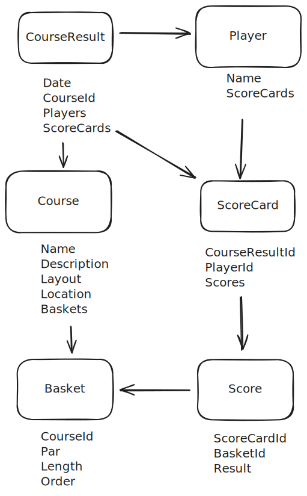
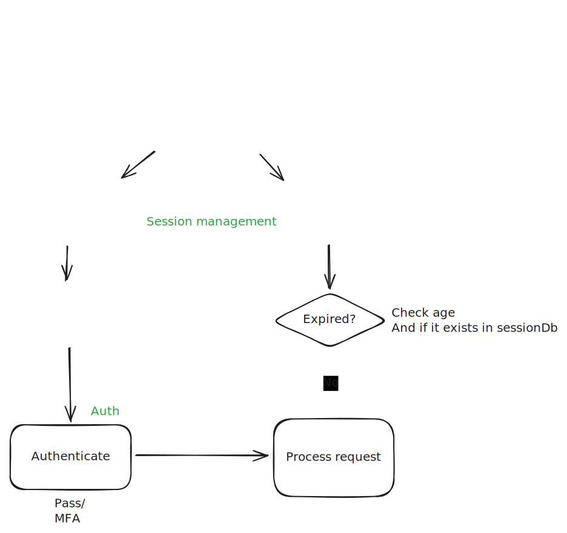

# Discgolf stats

## Dependencies

Download the dependencies specified in .tool-versions

### Optional

Use the [asdf package manager](https://github.com/asdf-vm/asdf) and add the plugins specified in the tool-versions file:

```shell
asdf plugin add nodejs https://github.com/asdf-vm/asdf-nodejs.git
asdf plugin-add pnpm
```

Install them by running:

```shell
asdf install
```

You can find all asdf plugins [here](https://github.com/asdf-vm/asdf-plugins)

## 🧞 Commands

```shell
pnpm install                                    # Installs dependencies
pnpm install --filter <backend|frontend>        # Install specific deps
pnpm dev                                        # Starts local dev server at localhost:4321
pnpm build                                      # Build your production site to ./dist/
pnpm preview                                    # Preview your build locally, before deploying
pnpm astro                                      # Run CLI commands like astro add, astro check
pnpm prisma migrate dev --name <e.g. semver>    # Create a db migration
pnpm prisma db seed                             # Seed the database with data from prisma/seed.ts
pnpm prisma studio                              # Browse your local prisma database
pnpm prisma db push                             # Push writes to your database (changes the structure) but not to the migration
```

## Data model



## Session and auth flow


